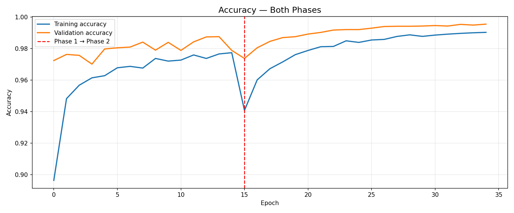
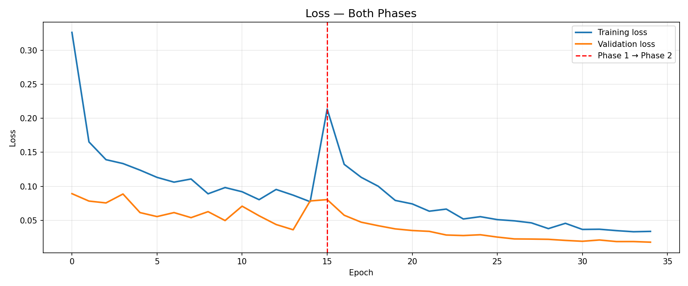

# 🌿 Crop Disease Detection & Severity Assessment

A deep learning web application that detects crop diseases from leaf images, assesses disease severity, and provides actionable treatment recommendations — built for real-world agricultural impact.

[](https://huggingface.co/spaces/AhadAhmad0/crop-disease-detection)
[](https://github.com/AhadAhmad0)
[](https://python.org)
[](https://tensorflow.org)

---

## 📸 App Screenshots


---

## 🎯 Problem Statement

Crop diseases cause an estimated **$220 billion** in agricultural losses annually worldwide. Smallholder farmers — who produce 70% of the world's food — often lack access to expert agronomists for timely disease diagnosis.

This application provides an instant, AI-powered diagnostic tool that any farmer can use by simply uploading a photo of a diseased leaf.

---

## ✅ What It Does

Upload a leaf image and the app returns:

- **Disease identification** — which disease is affecting the crop
- **Confidence score** — how certain the model is
- **Severity assessment** — Early / Moderate / Advanced stage
- **Treatment recommendations** — specific, actionable steps
- **Prevention advice** — how to avoid recurrence
- **Top 3 predictions** — alternative possibilities with confidence scores

---

## 🏗️ Two-Stage Pipeline

```
Input Image
     │
     ▼
┌─────────────────────────────┐
│   Stage 1: Classification   │
│   EfficientNetB0            │
│   Transfer Learning         │
│   14 Disease Classes        │
└─────────────────────────────┘
     │
     ▼
┌─────────────────────────────┐
│   Stage 2: Severity         │
│   Visual Feature Analysis   │
│   Lesion Area + Color       │
│   Early/Moderate/Advanced   │
└─────────────────────────────┘
     │
     ▼
┌─────────────────────────────┐
│   Treatment Lookup          │
│   Rule-based System         │
│   Disease + Severity mapped │
│   to specific treatments    │
└─────────────────────────────┘
     │
     ▼
Results + Recommendations
```

---

## 📊 Model Performance

| Metric | Score |
|--------|-------|
| Overall Accuracy | **99.55%** |
| Macro Precision | **99.56%** |
| Macro Recall | **99.56%** |
| Macro F1 Score | **99.55%** |
| Validation Images | **6,667** |

### Per-Class Performance

| Disease | Precision | Recall | F1 |
|---------|-----------|--------|----|
| Tomato Early Blight | 98.95% | 98.12% | 98.54% |
| Tomato Late Blight | 97.45% | 99.14% | 98.29% |
| Tomato Healthy | 99.79% | 99.79% | 99.79% |
| Corn Common Rust | 100.00% | 99.79% | 99.90% |
| Corn Northern Leaf Blight | 99.79% | 100.00% | 99.90% |
| Corn Healthy | 100.00% | 100.00% | 100.00% |
| Apple Scab | 100.00% | 98.41% | 99.20% |
| Apple Black Rot | 99.20% | 100.00% | 99.60% |
| Apple Healthy | 99.01% | 100.00% | 99.50% |
| Potato Early Blight | 99.79% | 100.00% | 99.90% |
| Potato Late Blight | 100.00% | 98.76% | 99.38% |
| Potato Healthy | 99.78% | 99.78% | 99.78% |
| Grape Black Rot | 100.00% | 100.00% | 100.00% |
| Grape Healthy | 100.00% | 100.00% | 100.00% |

### Training Curves




### Confusion Matrix


---

## 🌱 Supported Crops and Diseases

| Crop | Diseases Covered |
|------|-----------------|
| 🍅 Tomato | Early Blight, Late Blight, Healthy |
| 🌽 Corn | Common Rust, Northern Leaf Blight, Healthy |
| 🍎 Apple | Apple Scab, Black Rot, Healthy |
| 🥔 Potato | Early Blight, Late Blight, Healthy |
| 🍇 Grape | Black Rot, Healthy |

---

## 🛠️ Tech Stack

| Component | Technology |
|-----------|------------|
| Model Architecture | EfficientNetB0 (Transfer Learning) |
| Framework | TensorFlow 2.19 / Keras |
| Training Platform | Kaggle (Tesla P100 GPU) |
| Web Interface | Streamlit |
| Deployment | Hugging Face Spaces |
| Language | Python 3.10 |

---

## 🧠 Model Architecture

```
Input (224×224×3)
      │
      ▼
EfficientNetB0 (ImageNet weights, frozen in Phase 1)
      │
      ▼
GlobalAveragePooling2D
      │
      ▼
BatchNormalization
      │
      ▼
Dense(512, relu) → Dropout(0.4)
      │
      ▼
Dense(256, relu) → Dropout(0.3)
      │
      ▼
Dense(14, softmax)
```

**Two-phase training:**
- **Phase 1:** Base model frozen — only top layers trained (15 epochs)
- **Phase 2:** Top 30 layers unfrozen — fine-tuned with lr=1e-5 (20 epochs)

---

## 📁 Project Structure

```
Crop-Disease-Detection/
├── app.py                          # Streamlit web application
├── requirements.txt                # Dependencies
├── treatment_data.json             # Disease treatment database
├── README.md
│
├── model/
│   ├── crop_disease_model.keras    # Trained model (38.5MB)
│   └── class_names.json           # Class labels
│
├── src/
│   ├── utils.py                   # Preprocessing and severity assessment
│   ├── predict.py                 # Two-stage prediction pipeline
│   └── model.py                   # Model architecture definition
│
├── notebooks/
│   └── training.ipynb             # Training notebook (Kaggle)
│
└── assets/
    └── screenshots/               # App screenshots and plots
```

---

## 🚀 Run Locally

```bash
# Clone the repository
git clone https://github.com/AhadAhmad0/Crop-Disease-Detection.git
cd Crop-Disease-Detection

# Create virtual environment
py -3.10 -m venv venv
venv\Scripts\activate.bat

# Install dependencies
pip install -r requirements.txt

# Run the app
streamlit run app.py
```

---

## 🔑 Key Technical Decisions

**Why EfficientNetB0?**
EfficientNetB0 provides an excellent accuracy-to-size ratio. It achieves higher accuracy than VGG16 and ResNet50 at a fraction of the model size — critical for deployment on resource-constrained servers.

**Why two-phase training?**
Phase 1 trains only the classification head while the pre-trained ImageNet features remain intact. This prevents catastrophic forgetting. Phase 2 fine-tunes the top layers with a very low learning rate to adapt high-level features to plant disease patterns without destroying lower-level feature extraction.

**Why 14 classes instead of 38?**
The 14 selected classes cover the most agriculturally significant diseases in India — Tomato, Corn, Apple, Potato and Grape. A focused model on fewer high-impact classes outperforms a diluted model across all 38 classes in real-world deployment.

**The preprocessing challenge:**
During development, EfficientNetB0 in Keras 3 / TensorFlow 2.19 required raw 0-255 pixel values rather than normalized 0-1 values. Passing normalized inputs caused the model to output random 7% accuracy across all classes regardless of training. Identifying and fixing this preprocessing mismatch through systematic diagnostic testing was a critical engineering challenge in this project.

---

## 📈 Dataset

- **Source:** [New Plant Diseases Dataset](https://www.kaggle.com/datasets/vipoooool/new-plant-diseases-dataset) by Samir Bhattarai
- **Total images used:** ~26,000 (14 selected classes)
- **Training images:** ~21,000
- **Validation images:** 6,667
- **Image size:** 224×224 pixels
- **Augmentation:** Rotation, shift, shear, zoom, horizontal flip, brightness adjustment

---

## ⚠️ Limitations

- Currently supports 5 crops and 14 disease classes — does not cover all crop types
- Severity assessment uses visual heuristics — not a trained severity model
- Performance may vary on low-quality or blurry images
- Not a replacement for professional agronomist advice for severe cases

---

## 🔮 Future Improvements

- Expand to all 38 disease classes
- Train a dedicated CNN severity grading model using annotated severity datasets
- Add multi-language support for regional Indian languages
- Build a mobile app for offline use in areas with poor connectivity
- Integrate with government agricultural advisory APIs

---

## 👨‍💻 Author

**Ahad Ahmad**
AI/ML Engineering Student — Shri Ramswaroop Memorial University

[](https://github.com/AhadAhmad0)
[](https://www.linkedin.com/in/ahadahmad7/)

---

## 📄 License

This project is open source and available under the [MIT License](LICENSE).
